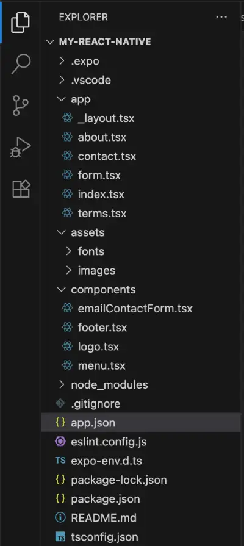

## React Native Expo – Full Tutorial

![Article banner] (react-native-banner.webp)

### Your Fast Track to Success

Mobile app development doesn't have to be an overwhelming maze of complex frameworks and endless tutorials. The secret to mastering this lucrative skill lies in choosing the right learning path that matches your background and goals. Whether you're a complete beginner or transitioning from web development, the most effective approach combines hands-on project building with structured learning. Start with a single cross-platform framework like React Native, Ionic, Swift or Flutter.
This comprehensive guide focuses on mobile dev coming from web dev based on today's competitive market. Unlike generic tutorials that teach isolated concepts, we'll walk you through the components that are the same and different in ReactJS. You'll discover exactly which technologies to learn first, how to avoid common pitfalls that derail beginners, and why building real projects from day one accelerates your learning exponentially.

| Feature | React Native | Ionic Framework | Flutter | Swift |
|---------|--------------|-----------------|---------|--------|
| **Primary Language** | JavaScript/TypeScript | HTML, CSS, JavaScript | Dart | Swift |
| **Platform Support** | iOS, Android | iOS, Android, Web, Desktop | iOS, Android, Web, Desktop | iOS, macOS, watchOS, tvOS |
| **Performance** | Near-native (uses native components) | Good (web-based with native shell) | Excellent (compiled to native code) | Excellent (truly native) |
| **Learning Curve** | Moderate (easier with React/JS background) | Easy (familiar web technologies) | Moderate to Steep (new language) | Steep (platform-specific knowledge required) |
| **Development Speed** | Fast | Very Fast | Fast | Slower (separate codebases) |
| **Community & Support** | Large, backed by Meta | Strong, backed by Ionic team | Growing rapidly, backed by Google | Strong, backed by Apple |
| **UI Customization** | High (native look & feel) | High (web-based flexibility) | Excellent (custom rendering engine) | Excellent (native controls) |
| **Code Reusability** | 70-80% across platforms | 90%+ across platforms | 90%+ across platforms | Platform-specific (0%) |
| **Popular Apps** | Facebook, Instagram, Uber Eats | MarketWatch, Sworkit, JustWatch | Google Ads, BMW, Alibaba | All native iOS apps |
| **Best For** | Rapid cross-platform development with native feel | Web developers, PWAs, quick prototypes | High-performance apps, custom UI | iOS-exclusive apps, maximum performance |
| **Market Demand** | Very High | Moderate | Rapidly Growing | High (iOS-specific roles) |


👉 This repo is from the article I wrote here.  [https://runastartup.com/about-react-native-expo-full-tutorial/]: https://runastartup.com/about-react-native-expo-full-tutorial/

⚠️ Note
### Which Should You Choose?
**Choose React Native if:** You have JavaScript/React experience and want to leverage existing skills for mobile development. It offers the best balance of performance, community support, and job opportunities.
**Choose Ionic if:** You're a web developer who wants to quickly transition to mobile using familiar HTML/CSS/JS skills, or you need to target web and mobile simultaneously.
**Choose Flutter if:** You want cutting-edge performance and don't mind learning Dart. It's Google's bet on the future of cross-platform development and shows tremendous growth potential.
**Choose Swift if:** You're focusing exclusively on iOS development, need maximum performance, or want to build apps that deeply integrate with Apple's ecosystem.
For beginners, React Native offers the most practical starting point due to its large community, extensive job market, and transferable JavaScript skills that remain valuable across web and mobile development.


### Coding Steps
1. Clone this repo
2. cd into directory and install
```
cd my-react-native
npm i
``` 
3. Start project
```
npx expo start
```

Upon completion your project should look like this:
  


